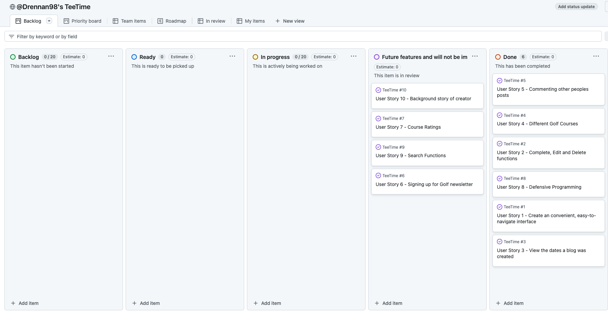

I'd like to start off my saying this was by some distance the most fun and interesting challenge I've come up against, I enjoyed coding it and had alot of fun (also some frustration).

I'm also grateful for the opportunity to try it, so thanks Rita and Sam for this chance. 

# If This Were a Long Term Project:

For a longer term project, the archictecture needs to be scalable, maintainable, and robust and require multiple changes and improvement. I went with a Tech Stack that I was comfortable with (HTML, CSS, JavaScript), which probably contributed to my frustration, I should have pushed myself outside of my comfort zone. 

## 1. Frontend Changes:

- **Frameworks:** Use a more complex frontend framework like React or Vue.js for better state management and user experience.

- **Styling:** Implement more complex design and responsive design using CSS frameworks like Tailwind CSS or Bootstrap. If these weren't used, the app could be made responsive by media queries. 

- **Error Handling:** Add better error handling on the frontend as to why a script can't be generated. 

## 2. Backend Changes:

- **Database Integration:** This would be vital for further development as it would track usage analytics. A database like PostgreSQL would be useful. 

- **Authorization:** Authentication can be added to personalize the user experience. I would suggest Django Allauth or something similar. 

## 3. API & Load Handling

- **Queue Management:** For high traffic, use a job queue system to process requests and avoid delays. 

## 4. Deployment

- **Deployment Platform:** If integrating Python, Heroku would be better suited for hosting backend files. 

## 5. Agile Methodology and Planning

- **User Stories:** Implementing user stories would be useful for identifying features that would benefit the user.

- **Kanban Board:** A Kanban Board to order tasks and manage backlog. See screenshot of my 4th project from my diploma. 

- **MoSCoW Prioritization:** For prioritising tasks and implementing the "Must Have"'s. 

## 6. Monitoring

- **Datadog:** Track performance and server health. 

## 7. UX/UI Testing

- Conduct user testing and gather feedback ensuring its intuitive and easy to use. Using Lighthouse audits from Google Dev Tools and using code validators and linters to ensure everything is in order. 